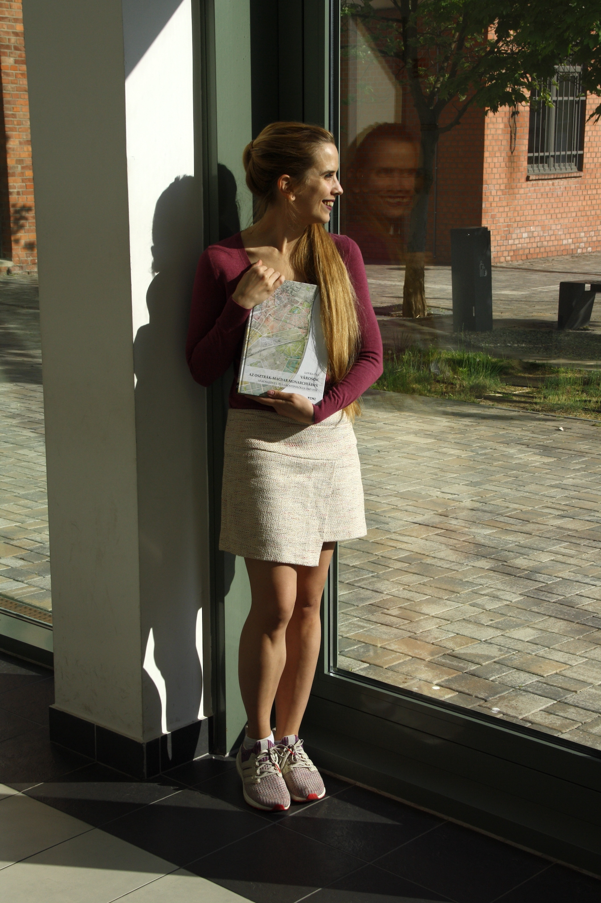

(1984, Topolya), építészmérnök Ph.D, településmérnök és építőmérnök M.Sc, városmorfológus. A Debreceni Egyetem Építőmérnöki Tanszékének egyetemi adjunktusa, városépítészetet, városmorfológiát, építéstörténetet, városrehabilitációt oktat magyar és angol nyelven. Műemlékvédelemi szakmérnöki tanulmányokat folytat a Budapesti Műszaki és Gazdaságtudományi Egyetemen. Kutatási területe a várostervezés-történet, városmorfológia, építészeti és városépítészeti kölcsönhatások (mikro-urbanizmus) Közép-Európában (1867–1918); építészet- és várostervezés-elmélet, szocialista modernizmus a II. világháború után (1948–1975); városi örökség meghatározása, értékelése. 
Prózakötete: Amikor otthon van a sehol (2011, Forum). Tudományos monográfiái: Szabadka urbanizmusa és építészete a második világháború után 1948–1975 (2014, Forum-VMTT); Városok az Osztrák-Magyar Monarchiában. Városszövet- és várostipológia 1867–1918 (2019, Terc Kft.).

